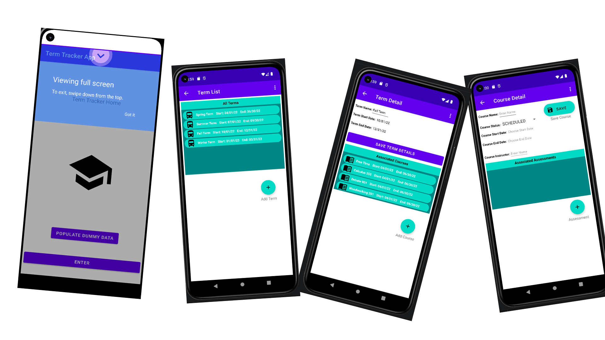

# 📱 Term Tracker (Mobile Academic Scheduler)

A native Android application designed to help students manage their academic terms, courses, and assessments. This app replaces manual tracking with a robust relational database solution, offering features like progress tracking, automated date alerts, and note sharing.



## 🚀 Key Features
* **Complex Data Relationships:** Tracks Terms, Courses, and Assessments with parent-child integrity constraints (e.g., preventing the deletion of a course that has attached assessments).
* **Automated Alerts:** Utilizes the `Android AlarmManager` to trigger push notifications for course start and end dates, even when the app is closed.
* **Note Sharing:** Implements Android's `Intent.ACTION_SEND` API to allow users to share course notes via SMS, Email, or other text-based apps.
* **Course Status Tracking:** Dropdown management for tracking course states (Plan to Take, In Progress, Completed, Dropped).

## 🛠 Tech Stack
* **Language:** Java 8
* **Minimum SDK:** Android SDK 26 (Android 8.0)
* **Target SDK:** Android SDK 32 (Android 12)
* **Database:** Room Persistence Library (SQLite Abstraction)
* **UI Components:** RecyclerView, ConstraintLayout, DatePickerDialog
* **Testing:** JUnit & Espresso

## ⚙️ How to Run This Project

### Prerequisites
* **Android Studio** (Recommended) or IntelliJ IDEA Ultimate
* **Java 11 or 17** (Ensure Gradle JVM is set to match)
* **Android SDK 31/32** installed via SDK Manager

### Installation Steps
1.  **Clone the Repository**
    ```bash
    git clone [https://github.com/YOUR_USERNAME/C196_Term_Tracker.git](https://github.com/YOUR_USERNAME/C196_Term_Tracker.git)
    ```
2.  **Open in Android Studio**
    * Select **File > Open** and choose the root folder.
    * Allow Gradle to sync (this downloads dependencies).
3.  **Configure Virtual Device**
    * Open **Device Manager**.
    * Create a virtual device (e.g., Pixel 5) targeting **API 31**.
4.  **Run the App**
    * Select the `app` configuration and your virtual device.
    * Click the **Green Play Button**.

## 🧠 Technical Implementation Highlights

### 1. Relational Database with Room
**Challenge:** Managing the hierarchy of `Terms -> Courses -> Assessments` and ensuring data persists between app restarts.
**Solution:** Implemented the Room Persistence Library. I created Entity classes for each data type and used DAOs (Data Access Objects) to map Java objects to SQLite tables. This allowed for compile-time verification of SQL queries and smoother asynchronous data retrieval.

### 2. System-Level Notification Broadcasting
**Challenge:** Alerting the user about upcoming assessment dates without draining the battery by keeping a background service running constantly.
**Solution:** Utilized the `AlarmManager` service in conjunction with a custom `BroadcastReceiver` (`AppReceiver`). The app schedules a `PendingIntent` for the future date; when triggered, the system wakes the receiver to display the notification, ensuring efficient resource usage.

### 3. Data Integrity Validation
**Challenge:** Preventing "orphaned" records (e.g., an assessment that belongs to a deleted course).
**Solution:** Implemented business logic within the `CourseDetail` activity that checks the database for associated assessments before allowing a delete operation. If dependencies exist, the user is alerted via a Toast message, and the deletion is blocked.

---
*Created as part of the WGU Software Development Capstone curriculum.*